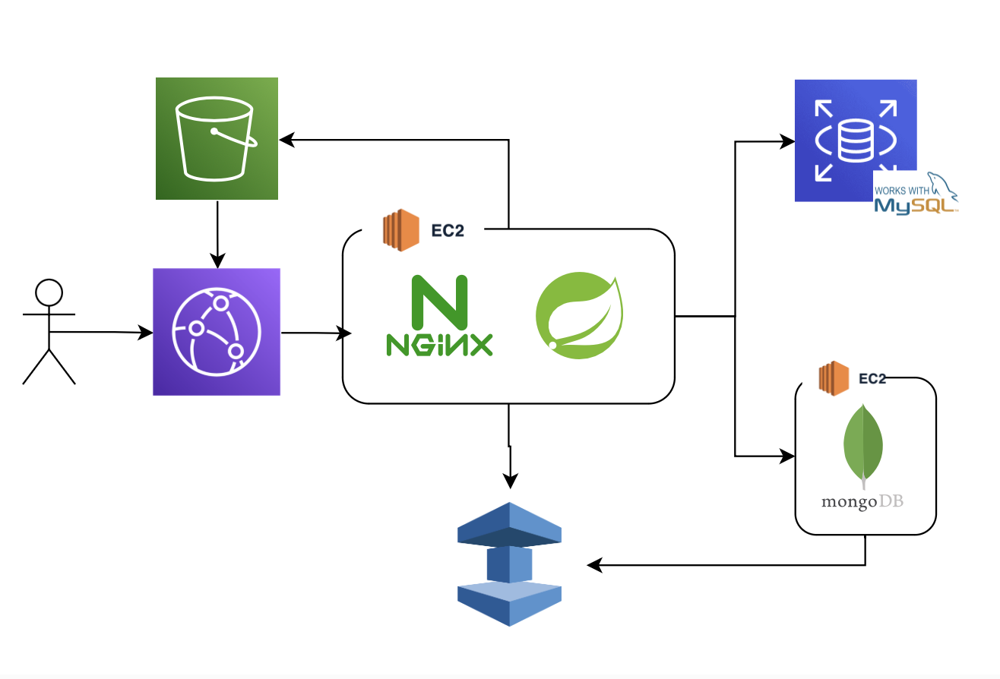

# EaseBook
A real-time social media platform built with WebSocket, enabling friend connections, live post updates, notifications, and personal info management. 
Includes private chat for real-time communication.
## Architecture

## Ｗebsite & How to use 
* Ｗebsite     
https://eveencode.com

* How to use (Live Demo)  
https://www.youtube.com/watch?v=kdPL2UqGf_I

## Main Features
* Search Friends  
   Users can search other users by username, send friend requests, and receive instant friend invitations.
* Post Creation  
   Users can create, edit, and delete posts with real-time post updates.
* Post Interaction  
   Users can like and comment on posts.
* Private Chat Room  
   Supports 1-on-1 online chatting with real-time chat notifications.
* Personal Information Page  
   Provides user profile pages and real-time updates of personal information.
## Techniques
* WebSocket
* JWT, Spring Security
* MongoDB, MySQL
* Nginx
* ElastiCache, CloudFront, Route53, EC2
